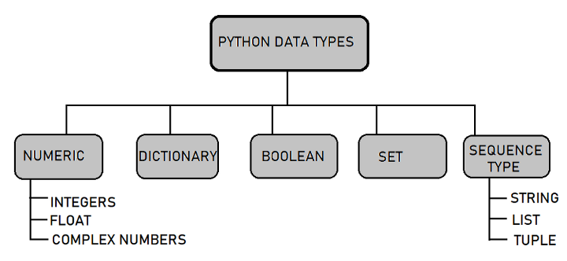

# Data Types

Data Types represent the kind of value variables can hold and what all operations can be performed on a particular data.

<figure><figcaption><p>Picture credit: GekksforGeeks.org</p></figcaption></figure>

### Intiger

```python
var = 5
print(var)
print(type(var))

### Output ###
# 5
# <class 'int'>
```

### Float

```python
var2 = 0.1234
print(var2)
print(type(var2))

### Output ###
# 0.1234
# <class 'float'>
```

### Complex Numbers

```python
x = 2j
print(x)
print(type(x))

### Output ###
# 2j
# <class 'complex'>
```

### **String**

```python
str_one = "Hello World"
print(str_one)
print(type(str_one))

### Output ###
# Hello World
# <class 'str'>
```

### Lists

```python
list1 = ["car","bike"]
print(list1)
print(type(list1))

### Output ###
# ['car', 'bike']
# <class 'list'
```

### Tuple

```python
tup= ("car","bike","bus")
print(tup)
print(type(tup))

### Output ###
# ('car', 'bike', 'bus')
# <class 'tuple'>
```

### Dictionary

```python
dict_one = {"Name": "Steve", "Location": "NewYork"}
print(dict_one)
print(type(dict_one))

### Output ###
# {'Name': 'Steve', 'Location': 'NewYork'}
# <class 'dict'>
```

### Set

```python
set_one = set({"Hello","world","Hello"})
print(set_one)
print(type(set_one))

### Output ###
# {'world', 'Hello'}
# <class 'set'>
```

### Frozen Set

```python
f_one = frozenset({"Hello","World","Hello"})
print(f_one)
print(type(f_one))

### Output ###
# frozenset({'Hello', 'World'})
# <class 'frozenset'>
```

### **Boolean**

```python
b = True
print(b)
print(type(b))

### Output ###
# True
# <class 'bool'>
```

### Byte

```python
byte_one = b"World"
print(type(byte_one))
print(byte_one)

### Output ###
# <class 'bytes'>
# b'World'
```
